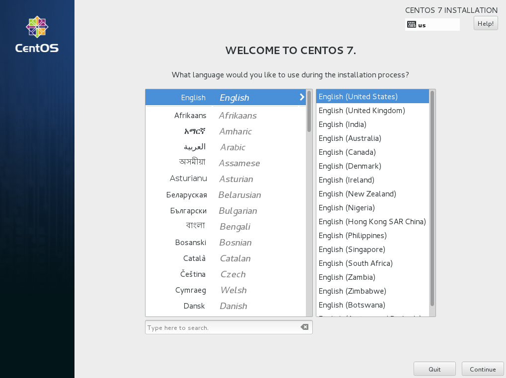
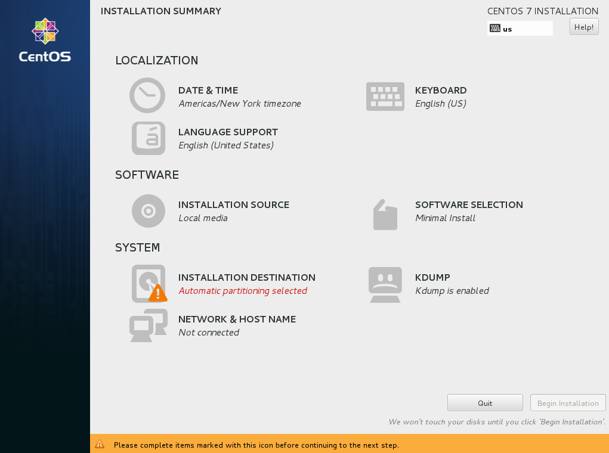
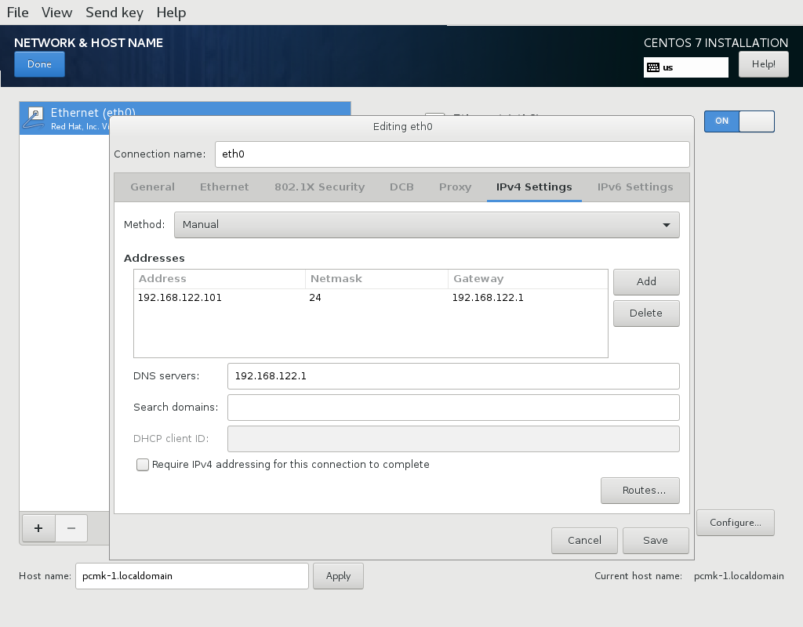
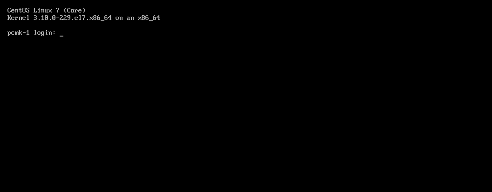

Installation
------------

Install |CFS_DISTRO| |CFS_DISTRO_VER|
################################################################################################

Boot the Install Image
______________________

Download the 4GB `|CFS_DISTRO| |CFS_DISTRO_VER| DVD ISO <http://isoredirect.centos.org/centos/7/isos/x86_64/CentOS-7-x86_64-DVD-1804.iso>`_.
Use the image to boot a virtual machine, or burn it to a DVD or USB drive and
boot a physical server from that.

After starting the installation, select your language and keyboard layout at
the welcome screen.

    |CFS_DISTRO| |CFS_DISTRO_VER| Installation Welcome Screen

Installation Options
____________________

At this point, you get a chance to tweak the default installation options.

    |CFS_DISTRO| |CFS_DISTRO_VER| Installation Summary Screen

Ignore the **SOFTWARE SELECTION** section (try saying that 10 times quickly). The
**Infrastructure Server** environment does have add-ons with much of the software
we need, but we will leave it as a **Minimal Install** here, so that we can see
exactly what software is required later.

Configure Network
_________________

In the **NETWORK & HOSTNAME** section:

- Edit **Host Name:** as desired. For this example, we will use
  **pcmk-1.localdomain**.
- Select your network device, press **Configure...**, and manually assign a fixed
  IP address. For this example, we'll use 192.168.122.101 under **IPv4 Settings**
  (with an appropriate netmask, gateway and DNS server).
- Flip the switch to turn your network device on, and press **Done**.

    |CFS_DISTRO| |CFS_DISTRO_VER| Network Interface Screen

.. IMPORTANT::

    Do not accept the default network settings.
    Cluster machines should never obtain an IP address via DHCP, because
    DHCP's periodic address renewal will interfere with corosync.

Configure Disk
______________

By default, the installer's automatic partitioning will use LVM (which allows
us to dynamically change the amount of space allocated to a given partition).
However, it allocates all free space to the ``/`` (aka. **root**) partition, which
cannot be reduced in size later (dynamic increases are fine).

In order to follow the DRBD and GFS2 portions of this guide, we need to reserve
space on each machine for a replicated volume.

Enter the **INSTALLATION DESTINATION** section, ensure the hard drive you want to
install to is selected, select **I will configure partitioning**, and press **Done**.

In the **MANUAL PARTITIONING** screen that comes next, click the option to create
mountpoints automatically. Select the ``/`` mountpoint, and reduce the desired
capacity by 1GiB or so. Select **Modify...** by the volume group name, and change
the **Size policy:** to **As large as possible**, to make the reclaimed space
available inside the LVM volume group. We'll add the additional volume later.

.. figure:: ../../shared/en-US/images/Partitioning.png
    :scale: 100%
    :width: 100%
    :align: center
    :alt: |CFS_DISTRO| |CFS_DISTRO_VER| Partitioning

    |CFS_DISTRO| |CFS_DISTRO_VER| Manual Partitioning Screen

Press **Done**, then **Accept changes**.

Configure Time Synchronization
______________________________

It is highly recommended to enable NTP on your cluster nodes. Doing so
ensures all nodes agree on the current time and makes reading log files
significantly easier.

|CFS_DISTRO| will enable NTP automatically. If you want to change any time-related
settings (such as time zone or NTP server), you can do this in the
**TIME & DATE** section.

Finish Install
______________

Select **Begin Installation**. Once it completes, set a root password, and reboot
as instructed. For the purposes of this document, it is not necessary to create
any additional users. After the node reboots, you'll see a login prompt on
the console. Login using **root** and the password you created earlier.

    |CFS_DISTRO| |CFS_DISTRO_VER| Console Prompt

.. NOTE::

    From here on, we're going to be working exclusively from the terminal.

Configure the OS
################

Verify Networking
_________________

Ensure that the machine has the static IP address you configured earlier.

::

    [root@pcmk-1 ~]# ip addr
    1: lo: <LOOPBACK,UP,LOWER_UP> mtu 65536 qdisc noqueue state UNKNOWN group default qlen 1000
        link/loopback 00:00:00:00:00:00 brd 00:00:00:00:00:00
        inet 127.0.0.1/8 scope host lo
           valid_lft forever preferred_lft forever
        inet6 ::1/128 scope host 
           valid_lft forever preferred_lft forever
    2: eth0: <BROADCAST,MULTICAST,UP,LOWER_UP> mtu 1500 qdisc pfifo_fast state UP group default qlen 1000
        link/ether 52:54:00:8e:eb:41 brd ff:ff:ff:ff:ff:ff
        inet 192.168.122.101/24 brd 192.168.122.255 scope global noprefixroute eth0
           valid_lft forever preferred_lft forever
        inet6 fe80::e45:c99b:34c0:c657/64 scope link noprefixroute 
           valid_lft forever preferred_lft forever

.. NOTE::

    If you ever need to change the node's IP address from the command line, follow
    these instructions, replacing **${device}** with the name of your network device:

    ::

        [root@pcmk-1 ~]# vi /etc/sysconfig/network-scripts/ifcfg-${device} # manually edit as desired
        [root@pcmk-1 ~]# nmcli dev disconnect ${device}
        [root@pcmk-1 ~]# nmcli con reload ${device}
        [root@pcmk-1 ~]# nmcli con up ${device}

    This makes **NetworkManager** aware that a change was made on the config file.

Next, ensure that the routes are as expected:

::

    [root@pcmk-1 ~]# ip route
    default via 192.168.122.1 dev eth0 proto static metric 100 
    192.168.122.0/24 dev eth0 proto kernel scope link src 192.168.122.101 metric 100 

If there is no line beginning with **default via**, then you may need to add a line such as

.. index ::
    pair: source; Bash

``GATEWAY="192.168.122.1"``

to the device configuration using the same process as described above for
changing the IP address.

Now, check for connectivity to the outside world. Start small by
testing whether we can reach the gateway we configured.

::

    [root@pcmk-1 ~]# ping -c 1 192.168.122.1
    PING 192.168.122.1 (192.168.122.1) 56(84) bytes of data.
    64 bytes from 192.168.122.1: icmp_seq=1 ttl=64 time=0.254 ms

    --- 192.168.122.1 ping statistics ---
    1 packets transmitted, 1 received, 0% packet loss, time 0ms
    rtt min/avg/max/mdev = 0.254/0.254/0.254/0.000 ms

Now try something external; choose a location you know should be available.

::

    [root@pcmk-1 ~]# ping -c 1 www.clusterlabs.org
    PING oss-uk-1.clusterlabs.org (109.74.197.241) 56(84) bytes of data.
    64 bytes from oss-uk-1.clusterlabs.org (109.74.197.241): icmp_seq=1 ttl=49 time=333 ms

    --- oss-uk-1.clusterlabs.org ping statistics ---
    1 packets transmitted, 1 received, 0% packet loss, time 0ms
    rtt min/avg/max/mdev = 333.204/333.204/333.204/0.000 ms

Login Remotely
______________

The console isn't a very friendly place to work from, so we will now
switch to accessing the machine remotely via SSH where we can
use copy and paste, etc.

From another host, check whether we can see the new host at all:

::

    beekhof@f16 ~ # ping -c 1 192.168.122.101
    PING 192.168.122.101 (192.168.122.101) 56(84) bytes of data.
    64 bytes from 192.168.122.101: icmp_req=1 ttl=64 time=1.01 ms

    --- 192.168.122.101 ping statistics ---
    1 packets transmitted, 1 received, 0% packet loss, time 0ms
    rtt min/avg/max/mdev = 1.012/1.012/1.012/0.000 ms

Next, login as root via SSH.

::

    beekhof@f16 ~ # ssh -l root 192.168.122.101
    The authenticity of host '192.168.122.101 (192.168.122.101)' can't be established.
    ECDSA key fingerprint is 6e:b7:8f:e2:4c:94:43:54:a8:53:cc:20:0f:29:a4:e0.
    Are you sure you want to continue connecting (yes/no)? yes
    Warning: Permanently added '192.168.122.101' (ECDSA) to the list of known hosts.
    root@192.168.122.101's password:
    Last login: Tue Aug 11 13:14:39 2015
    [root@pcmk-1 ~]#

Apply Updates
_____________

Apply any package updates released since your installation image was created:

::

    [root@pcmk-1 ~]# yum update

Use Short Node Names
____________________

During installation, we filled in the machine's fully qualified domain
name (FQDN), which can be rather long when it appears in cluster logs and
status output. See for yourself how the machine identifies itself:

.. index ::
    pair: Nodes; short name

::

    [root@pcmk-1 ~]# uname -n
    pcmk-1.localdomain

.. index ::
    pair: Nodes; Domain name (Query)

We can use the `hostnamectl` tool to strip off the domain name:

::

    [root@pcmk-1 ~]# hostnamectl set-hostname $(uname -n | sed s/\\..*//)

.. index ::
    pair: Nodes; Domain name (Remove from host name)

Now, check that the machine is using the correct name:

::

    [root@pcmk-1 ~]# uname -n
    pcmk-1

You may want to reboot to ensure all updates take effect.

Repeat for Second Node
######################

Repeat the Installation steps so far, so that you have two
nodes ready to have the cluster software installed.

For the purposes of this document, the additional node is called
pcmk-2 with address 192.168.122.102.

Configure Communication Between Nodes
#####################################

Configure Host Name Resolution
______________________________

Confirm that you can communicate between the two new nodes:

::

    [root@pcmk-1 ~]# ping -c 3 192.168.122.102
    PING 192.168.122.102 (192.168.122.102) 56(84) bytes of data.
    64 bytes from 192.168.122.102: icmp_seq=1 ttl=64 time=0.343 ms
    64 bytes from 192.168.122.102: icmp_seq=2 ttl=64 time=0.402 ms
    64 bytes from 192.168.122.102: icmp_seq=3 ttl=64 time=0.558 ms

    --- 192.168.122.102 ping statistics ---
    3 packets transmitted, 3 received, 0% packet loss, time 2000ms
    rtt min/avg/max/mdev = 0.343/0.434/0.558/0.092 ms

Now we need to make sure we can communicate with the machines by their
name. If you have a DNS server, add additional entries for the two
machines. Otherwise, you'll need to add the machines to ``/etc/hosts``
on both nodes. Below are the entries for my cluster nodes:

::

    [root@pcmk-1 ~]# grep pcmk /etc/hosts
    192.168.122.101 pcmk-1.clusterlabs.org pcmk-1
    192.168.122.102 pcmk-2.clusterlabs.org pcmk-2

We can now verify the setup by again using ping:

::

    [root@pcmk-1 ~]# ping -c 3 pcmk-2
    PING pcmk-2.clusterlabs.org (192.168.122.101) 56(84) bytes of data.
    64 bytes from pcmk-1.clusterlabs.org (192.168.122.101): icmp_seq=1 ttl=64 time=0.164 ms
    64 bytes from pcmk-1.clusterlabs.org (192.168.122.101): icmp_seq=2 ttl=64 time=0.475 ms
    64 bytes from pcmk-1.clusterlabs.org (192.168.122.101): icmp_seq=3 ttl=64 time=0.186 ms

    --- pcmk-2.clusterlabs.org ping statistics ---
    3 packets transmitted, 3 received, 0% packet loss, time 2001ms
    rtt min/avg/max/mdev = 0.164/0.275/0.475/0.141 ms

Configure SSH
_____________

SSH is a convenient and secure way to copy files and perform commands
remotely. For the purposes of this guide, we will create a key without a
password (using the -N option) so that we can perform remote actions
without being prompted.

.. index::
    single: SSH

.. WARNING::

    Unprotected SSH keys (those without a password) are not recommended for
    servers exposed to the outside world.  We use them here only to simplify
    the demo.

Create a new key and allow anyone with that key to log in:

.Creating and Activating a new SSH Key

::

    [root@pcmk-1 ~]# ssh-keygen -t dsa -f ~/.ssh/id_dsa -N ""
    Generating public/private dsa key pair.
    Your identification has been saved in /root/.ssh/id_dsa.
    Your public key has been saved in /root/.ssh/id_dsa.pub.
    The key fingerprint is:
    91:09:5c:82:5a:6a:50:08:4e:b2:0c:62:de:cc:74:44 root@pcmk-1.clusterlabs.org
    The key's randomart image is:
    +--[ DSA 1024]----+
    |==.ooEo..        |
    |X O + .o o       |
    | * A    +        |
    |  +      .       |
    | .      S        |
    |                 |
    |                 |
    |                 |
    |                 |
    +-----------------+
    [root@pcmk-1 ~]# cp ~/.ssh/id_dsa.pub ~/.ssh/authorized_keys

.. index::
    single: Creating and Activating a new SSH Key

Install the key on the other node:

::

    [root@pcmk-1 ~]# scp -r ~/.ssh pcmk-2:
    The authenticity of host 'pcmk-2 (192.168.122.102)' can't be established.
    ECDSA key fingerprint is SHA256:63xNPkPYq98rYznf3T9QYJAzlaGiAsSgFVNHOZjPWqc.
    ECDSA key fingerprint is MD5:d9:bf:6e:32:88:be:47:3d:96:f1:96:27:65:05:0b:c3.
    Are you sure you want to continue connecting (yes/no)? yes
    Warning: Permanently added 'pcmk-2,192.168.122.102' (ECDSA) to the list of known hosts.
    root@pcmk-2's password:
    id_dsa
    id_dsa.pub
    authorized_keys
    known_hosts

Test that you can now run commands remotely, without being prompted:

::

    [root@pcmk-1 ~]# ssh pcmk-2 -- uname -n
    pcmk-2
