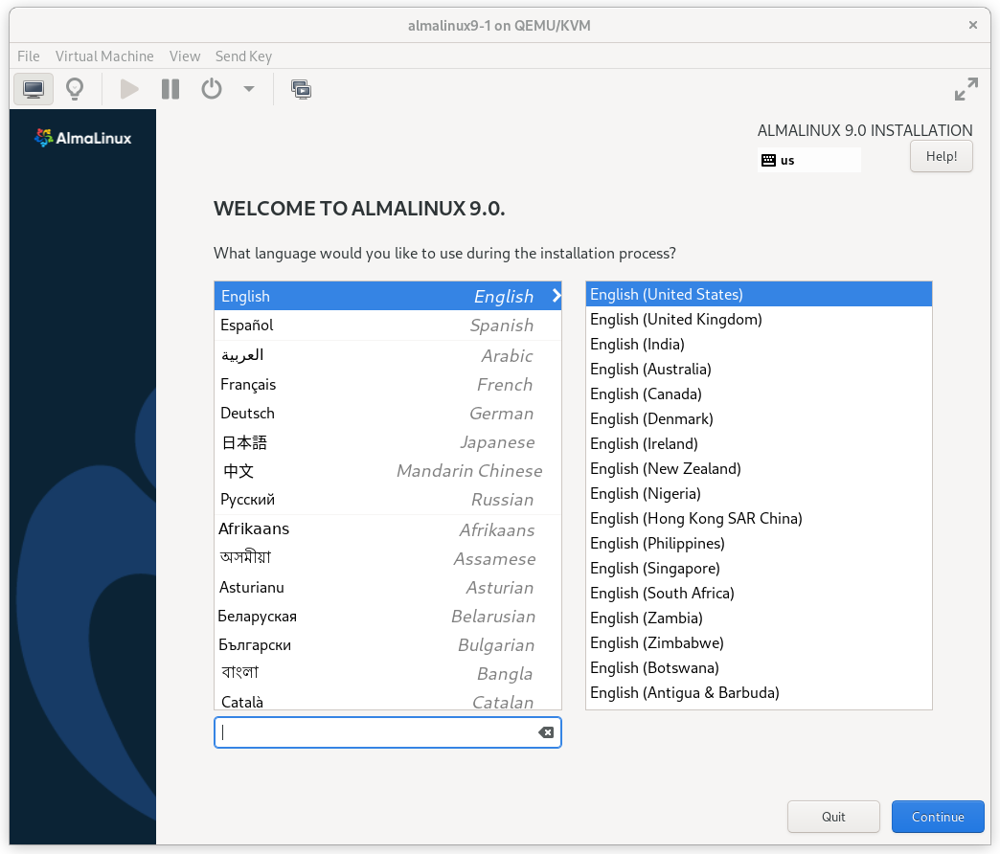
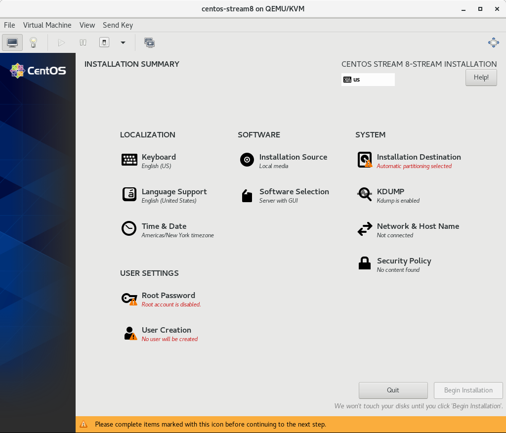
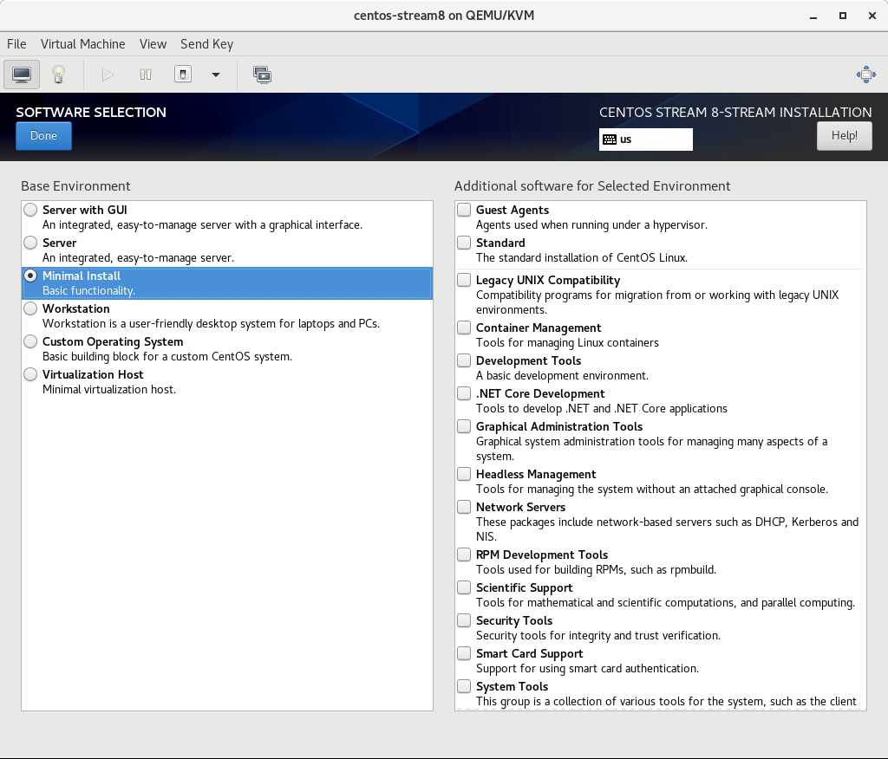
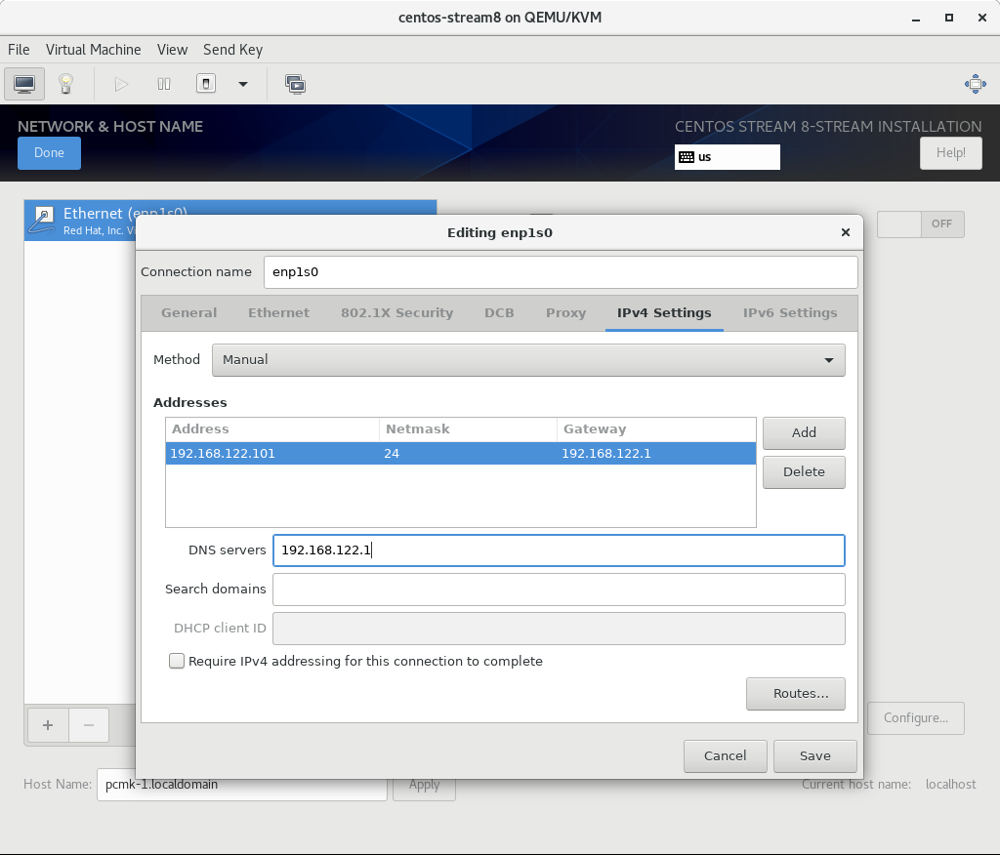
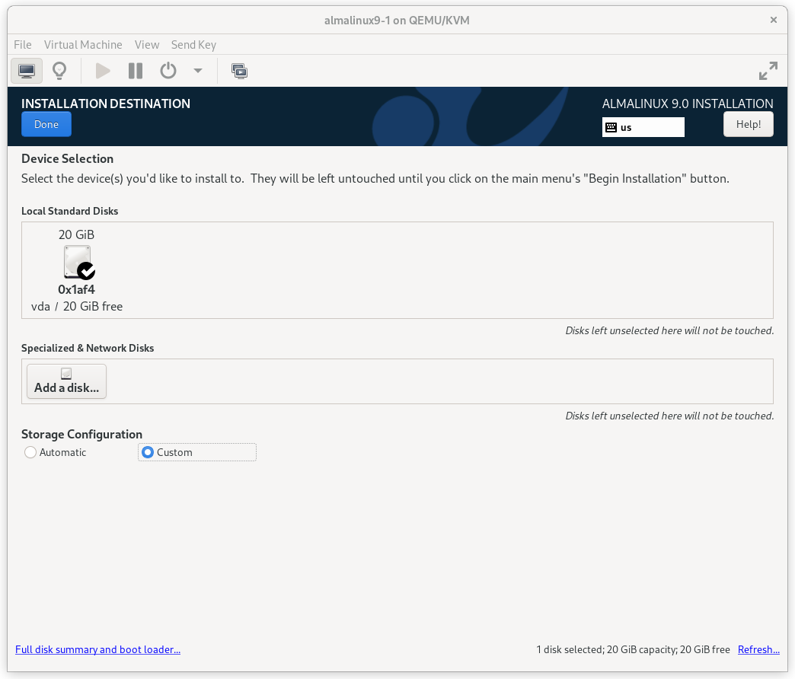
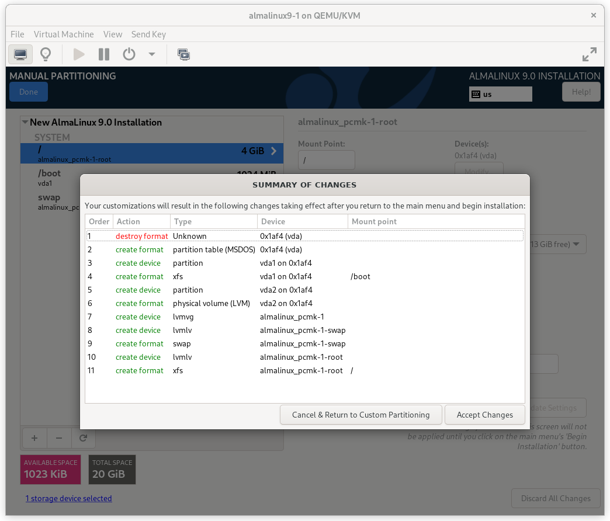
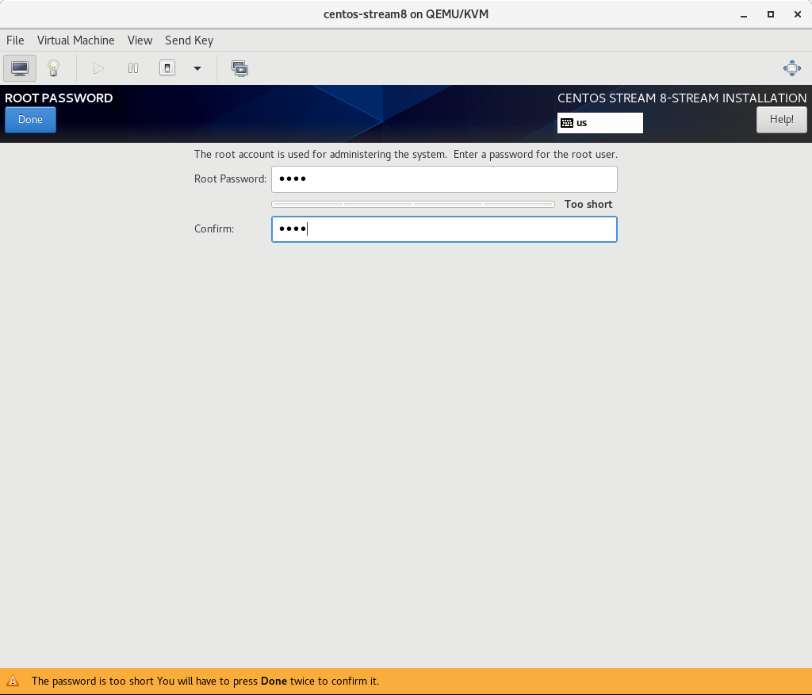
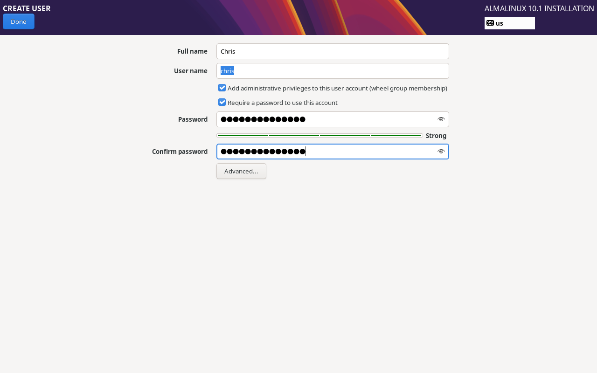
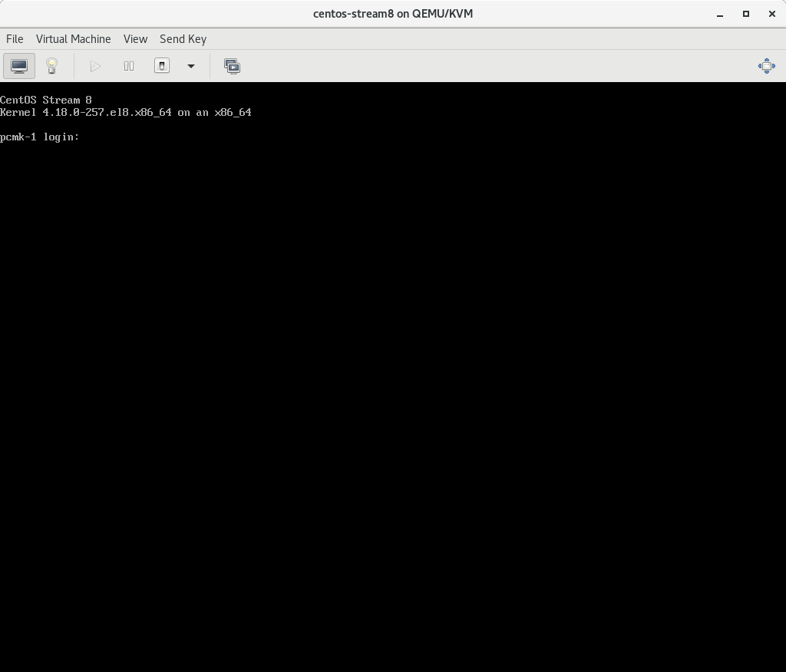

Installation
------------

Install |CFS_DISTRO| |CFS_DISTRO_VER|
################################################################################################

Boot the Install Image
______________________

Download the latest |CFS_DISTRO| |CFS_DISTRO_VER| DVD ISO by navigating to
the |CFS_DISTRO| `mirrors list <https://mirrors.almalinux.org/isos.html>`_,
selecting the latest |CFS_DISTRO_VER|.x version for your machine's architecture,
selecting a download mirror that's close to you, and finally selecting the latest
.iso file that has “dvd” in its name. Use the image to boot a virtual machine, or
burn it to a DVD or USB drive and boot a physical server from that.

After starting the installation, select your language and keyboard layout at
the welcome screen.

    |CFS_DISTRO| |CFS_DISTRO_VER| Installation Welcome Screen

Installation Options
____________________

At this point, you get a chance to tweak the default installation options.

    |CFS_DISTRO| |CFS_DISTRO_VER| Installation Summary Screen

Click on the **SOFTWARE SELECTION** section (try saying that 10 times quickly). The
default environment, **Server with GUI**, does have add-ons with much of the software
we need, but we will change the environment to a **Minimal Install** here, so that we
can see exactly what software is required later, and press **Done**.

    |CFS_DISTRO| |CFS_DISTRO_VER| Software Selection Screen

Configure Network
_________________

In the **NETWORK & HOST NAME** section:

- Edit **Host Name:** as desired. For this example, we will enter
  ``pcmk-1.localdomain`` and then press **Apply**.
- Select your network device, press **Configure...**, select the **IPv4
  Settings** tab, and select **Manual** from the **Method** dropdown menu. Then
  assign the machine a fixed IP address with an appropriate netmask, gateway,
  and DNS server. For this example, we'll use ``192.168.122.101`` for the
  address, ``24`` for the netmask, and ``192.168.122.1`` for the gateway and
  DNS server.
- Press **Save**.
- Flip the switch to turn your network device on (if it is not on already), and
  press **Done**.

    |CFS_DISTRO| |CFS_DISTRO_VER| Network Interface Screen

.. IMPORTANT::

    Do not accept the default network settings.
    Cluster machines should never obtain an IP address via DHCP, because
    DHCP's periodic address renewal will interfere with Corosync.

Configure Disk
______________

By default, the installer's automatic partitioning will use LVM (which allows
us to dynamically change the amount of space allocated to a given partition).
However, it allocates all free space to the ``/`` (a.k.a. **root**) partition,
which cannot be reduced in size later (dynamic increases are fine).

In order to follow the DRBD and GFS2 portions of this guide, we need to reserve
space on each machine for a replicated volume.

Enter the **INSTALLATION DESTINATION** section and select the disk where you
want to install the OS. Then under **Storage Configuration**, select **Custom**
and press **Done**.

    |CFS_DISTRO| |CFS_DISTRO_VER| Installation Destination Screen

On the **MANUAL PARTITIONING** screen that comes next, click the option to create
mountpoints automatically. Select the ``/`` mountpoint and reduce the **Desired
Capacity** down to 4 GiB or so. (The installer will not allow you to proceed if
the ``/`` filesystem is too small to install all required packages.)

.. figure:: images/ManualPartitioning.png
    :align: center
    :alt: Manual Partitioning Screen

    |CFS_DISTRO| |CFS_DISTRO_VER| Manual Partitioning Screen

Then select **Modify…** next to the volume group name. In the **CONFIGURE
VOLUME GROUP** dialog box that appears, change the **Size policy** to **As
large as possible**, to make the reclaimed space available inside the LVM
volume group. We’ll add the additional volume later.

.. figure:: images/ConfigureVolumeGroup.png
    :align: center
    :alt: Configure Volume Group Dialog

    |CFS_DISTRO| |CFS_DISTRO_VER| Configure Volume Group Dialog

Press **Done**. Finally, in the **SUMMARY OF CHANGES** dialog box, press
**Accept Changes**.

    |CFS_DISTRO| |CFS_DISTRO_VER| Summary of Changes Dialog

Configure Time Synchronization
______________________________

It is highly recommended to enable NTP on your cluster nodes. Doing so
ensures all nodes agree on the current time and makes reading log files
significantly easier.

|CFS_DISTRO| will enable NTP automatically. If you want to change any time-related
settings (such as time zone or NTP server), you can do this in the
**TIME & DATE** section. In this example, we configure the time zone as UTC
(Coordinated Universal Time).

.. figure:: images/TimeAndDate.png
    :align: center
    :alt: Time & Date Screen

    |CFS_DISTRO| |CFS_DISTRO_VER| Time & Date Screen

Root Account
______________________________

In the **ROOT ACCOUNT** section, it is highly recommended to disable the root
account.  We'll use a local user to perform administration tasks with sudo.

    |CFS_DISTRO| |CFS_DISTRO_VER| Root Account Screen

Press **Done**.

Create User
______________________________

In the **CREATE USER** section, create a new user with a secure password.  Make
sure to select **Add administrative privileges to the user account (wheel group
membership)** so the user can administer the system.

    |CFS_DISTRO| |CFS_DISTRO_VER| Create User Screen

Press **Done**.

Finish Install
______________

Select **Begin Installation**. Once it completes, **Reboot System**
as instructed.  After the node reboots, you'll see a login prompt on
the console. Login using ``root`` and the password you created earlier.

    |CFS_DISTRO| |CFS_DISTRO_VER| Console Prompt

.. NOTE::

    From here on, we're going to be working exclusively from the terminal.

Configure the OS
################

Verify Networking
_________________

Ensure that the machine has the static IP address you configured earlier.

.. code-block:: console

    [root@pcmk-1 ~]# ip addr
    1: lo: <LOOPBACK,UP,LOWER_UP> mtu 65536 qdisc noqueue state UNKNOWN group default qlen 1000
	link/loopback 00:00:00:00:00:00 brd 00:00:00:00:00:00
	inet 127.0.0.1/8 scope host lo
	   valid_lft forever preferred_lft forever
	inet6 ::1/128 scope host
	   valid_lft forever preferred_lft forever
    2: enp1s0: <BROADCAST,MULTICAST,UP,LOWER_UP> mtu 1500 qdisc fq_codel state UP group default qlen 1000
	link/ether 52:54:00:32:cf:a9 brd ff:ff:ff:ff:ff:ff
	inet 192.168.122.101/24 brd 192.168.122.255 scope global noprefixroute enp1s0
	   valid_lft forever preferred_lft forever
	inet6 fe80::c3e1:3ba:959:fa96/64 scope link noprefixroute
	   valid_lft forever preferred_lft forever

.. NOTE::

    If you ever need to change the node's IP address from the command line,
    follow these instructions, replacing ``${conn}`` with the name of your
    network connection. You can find the list of all network connection names
    by running ``nmcli con show``; you can get details for each connection by
    running ``nmcli con show ${conn}``.

    .. code-block:: console

        [root@pcmk-1 ~]# nmcli con mod ${conn} ipv4.addresses "${new_address}"
        [root@pcmk-1 ~]# nmcli con up ${conn}

Next, ensure that the routes are as expected:

.. code-block:: console

    [root@pcmk-1 ~]# ip route
    default via 192.168.122.1 dev enp1s0 proto static 192.168.122.101 metric 100
    192.168.122.0/24 dev enp1s0 proto kernel scope link src 192.168.122.101 metric 100

If there is no line beginning with ``default via``, then use ``nmcli`` to add a
gateway:

.. code-block:: console

    [root@pcmk-1 ~]# nmcli con mod ${conn} ipv4.gateway "${new_gateway_addr}"
    [root@pcmk-1 ~]# nmcli con up ${conn}

Now, check for connectivity to the outside world. Start small by
testing whether we can reach the gateway we configured.

.. code-block:: console

    [root@pcmk-1 ~]# ping -c 1 192.168.122.1
    PING 192.168.122.1 (192.168.122.1) 56(84) bytes of data.
    64 bytes from 192.168.122.1: icmp_seq=1 ttl=64 time=0.492 ms

    --- 192.168.122.1 ping statistics ---
    1 packets transmitted, 1 received, 0% packet loss, time 0ms
    rtt min/avg/max/mdev = 0.492/0.492/0.492/0.000 ms

Now try something external; choose a location you know should be available.

.. code-block:: console

    [root@pcmk-1 ~]# ping -c 1 www.clusterlabs.org
    PING mx1.clusterlabs.org (95.217.104.78) 56(84) bytes of data.
    64 bytes from mx1.clusterlabs.org (95.217.104.78): icmp_seq=1 ttl=54 time=134 ms

    --- mx1.clusterlabs.org ping statistics ---
    1 packets transmitted, 1 received, 0% packet loss, time 0ms
    rtt min/avg/max/mdev = 133.987/133.987/133.987/0.000 ms

Login Remotely
______________

The console isn't a very friendly place to work from, so we will now
switch to accessing the machine remotely via SSH where we can
use copy and paste, etc.

From another host, check whether we can see the new host at all:

.. code-block:: console

    [chris@laptop ~]$ ping -c 1 192.168.122.101
    PING 192.168.122.101 (192.168.122.101) 56(84) bytes of data.
    64 bytes from 192.168.122.101: icmp_seq=1 ttl=64 time=0.344 ms

    --- 192.168.122.101 ping statistics ---
    1 packets transmitted, 1 received, 0% packet loss, time 0ms
    rtt min/avg/max/mdev = 0.344/0.344/0.344/0.000 ms

Next, login as the user you created during installation via SSH.

.. code-block:: console

    [chris@laptop~]$ ssh 192.168.122.101
    The authenticity of host '192.168.122.101 (192.168.122.101)' can't be established.
    ECDSA key fingerprint is SHA256:NBvcRrPDLIt39Rf0Tz4/f2Rd/FA5wUiDOd9bZ9QWWjo.
    This key is not known by any other names.
    Are you sure you want to continue connecting (yes/no/[fingerprint])? yes
    Warning: Permanently added '192.168.122.101' (ECDSA) to the list of known hosts.
    chris@192.168.122.101's password:
    Last login: Tue Feb 24 13:03:51 2026
    [chris@pcmk-1 ~]#

.. NOTE::

    From here on, you'll need to be ``root`` to administer the system.  The
    ``sudo`` command can be used to switch from the user you created during
    installation to the ``root`` user.

Apply Updates
_____________

Apply any package updates released since your installation image was created:

.. code-block:: console

    [root@pcmk-1 ~]# dnf update -y

.. index::
    single: node; short name

Use Short Node Names
____________________

During installation, we filled in the machine's fully qualified domain
name (FQDN), which can be rather long when it appears in cluster logs and
status output. See for yourself how the machine identifies itself:

.. code-block:: console

    [root@pcmk-1 ~]# uname -n
    pcmk-1.localdomain

We can use the ``hostnamectl`` tool to strip off the domain name:

.. code-block:: console

    [root@pcmk-1 ~]# hostnamectl set-hostname $(uname -n | sed s/\\..*//)

Now, check that the machine is using the correct name:

.. code-block:: console

    [root@pcmk-1 ~]# uname -n
    pcmk-1

You may want to reboot to ensure all updates take effect.

Repeat for Second Node
######################

Repeat the installation steps so far, so that you have two
nodes ready to have the cluster software installed.

For the purposes of this document, the additional node is called
``pcmk-2`` with address ``192.168.122.102``.

Configure Communication Between Nodes
#####################################

Configure Host Name Resolution
______________________________

Confirm that you can communicate between the two new nodes:

.. code-block:: console

    [root@pcmk-1 ~]# ping -c 3 192.168.122.102
    PING 192.168.122.102 (192.168.122.102) 56(84) bytes of data.
    64 bytes from 192.168.122.102: icmp_seq=1 ttl=64 time=1.22 ms
    64 bytes from 192.168.122.102: icmp_seq=2 ttl=64 time=0.795 ms
    64 bytes from 192.168.122.102: icmp_seq=3 ttl=64 time=0.751 ms

    --- 192.168.122.102 ping statistics ---
    3 packets transmitted, 3 received, 0% packet loss, time 2054ms
    rtt min/avg/max/mdev = 0.751/0.923/1.224/0.214 ms

Now we need to make sure we can communicate with the machines by their
name. Add entries for the machines to ``/etc/hosts`` on both nodes. You can
add entries for the machines to your DNS server if you have one, but this can
create a single-point-of-failure (SPOF) if the DNS server goes down [#]_. If
you add entries to ``/etc/hosts``, they should look something like the
following:

.. code-block:: console

    [root@pcmk-1 ~]# grep pcmk /etc/hosts
    192.168.122.101 pcmk-1.localdomain  pcmk-1
    192.168.122.102 pcmk-2.localdomain  pcmk-2

We can now verify the setup by again using ``ping``:

.. code-block:: console

    [root@pcmk-1 ~]# ping -c 3 pcmk-2
    PING pcmk-2.localdomain (192.168.122.102) 56(84) bytes of data.
    64 bytes from pcmk-2.localdomain (192.168.122.102): icmp_seq=1 ttl=64 time=0.295 ms
    64 bytes from pcmk-2.localdomain (192.168.122.102): icmp_seq=2 ttl=64 time=0.616 ms
    64 bytes from pcmk-2.localdomain (192.168.122.102): icmp_seq=3 ttl=64 time=0.809 ms

    --- pcmk-2.localdomain ping statistics ---
    3 packets transmitted, 3 received, 0% packet loss, time 2043ms
    rtt min/avg/max/mdev = 0.295/0.573/0.809/0.212 ms

.. index:: SSH

Configure SSH
_____________

SSH is a convenient and secure way to copy files and perform commands
remotely. For the purposes of this guide, we will create a key without a
password (using the ``-N`` option) so that we can perform remote actions
without being prompted.

.. WARNING::

    Unprotected SSH keys (those without a password) are not recommended for
    servers exposed to the outside world.  We use them here only to simplify
    the demo.

Create a new key and allow anyone with that key to log in:

.. index::
    single: SSH; key

.. topic:: Creating and Activating a New SSH Key

   .. code-block:: console

        [root@pcmk-1 ~]# ssh-keygen -f ~/.ssh/id_ed25519 -N ""
        Generating public/private ed25519 key pair.
        Your identification has been saved in /root/.ssh/id_ed25519
        Your public key has been saved in /root/.ssh/id_ed25519.pub
        The key fingerprint is:
        SHA256:BhlHJU3REGOpO0FA7Mqvp60WaB/2unQOZki+0mZKfee8 root@pcmk-1
        The key's randomart image is:
        +--[ED255219 256]--+
        |     .o=++=+      |
        |      o.*..       |
        |     + B          |
        |    . * o         |
        |   ..+oo S        |
        |   +B++ .         |
        |  o=*o.o          |
        |o.==oo..          |
        | +B+.+E.          |
        +----[SHA256]------+

        [root@pcmk-1 ~]# cat ~/.ssh/id_25519.pub >> ~/.ssh/authorized_keys
        [root@pcmk-1 ~]# chmod 600 ~/.ssh/authorized_keys

Install the key on the other node.  Because you can't login as root on the
console or over SSH yet (that's what we're setting up now), the easiest way
to do this is as follows:

#. SSH into both nodes as the regular user.
#. Use ``sudo`` to become ``root`` on each node.
#. On ``pcmk-1``, cat the ``/root/.ssh/id_ed25519`` file and copy its contents
   with the mouse.
#. On ``pcmk-2``, paste those contents into ``/root/.ssh/id_ed25519``.
#. ``chmod 600 /root/.ssh/id_ed25519``.
#. On ``pcmk-1``, cat the ``/root/.ssh/id_25519.pub`` file and copy its
   contents with the mouse.
#. On ``pcmk-2``, paste those contents into ``/root/.ssh/authorized_keys``.
#. ``chmod 600 /root/.ssh/authorized_keys``

Test that you can now run commands remotely, without being prompted:

.. code-block:: console

    [root@pcmk-1 ~]# ssh pcmk-2 -- uname -n
    pcmk-2

It may also be handy to generate an SSH key on your administrative machine
as your regular user and use ``ssh-copy-id`` to copy it to both cluster nodes.

.. [#] You can also avoid this SPOF by specifying an ``addr`` option for each
       node when creating the cluster. We will discuss this in a later section.
