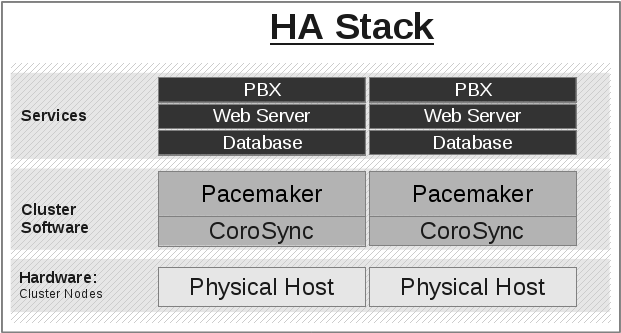

Scaling a Pacemaker Cluster
---------------------------

Overview
########

In a basic Pacemaker high-availability cluster [#]_ each node runs the full
cluster stack of Corosync and all Pacemaker components.  This allows great
flexibility but limits scalability to around 32 nodes.

To allow for scalability to dozens or even hundreds of nodes, Pacemaker
allows nodes not running the full cluster stack to integrate into the cluster
and have the cluster manage their resources as if they were a cluster node.

Terms
#####

.. index::
   single: cluster node
   single: node; cluster node

**cluster node**
    A node running the full high-availability stack of corosync and all
    Pacemaker components. Cluster nodes may run cluster resources, run
    all Pacemaker command-line tools (``crm_mon``, ``crm_resource`` and so on),
    execute fencing actions, count toward cluster quorum, and serve as the
    cluster's Designated Controller (DC).

.. index:: pacemaker-remoted

**pacemaker-remoted**
    A small service daemon that allows a host to be used as a Pacemaker node
    without running the full cluster stack. Nodes running ``pacemaker-remoted``
    may run cluster resources and most command-line tools, but cannot perform
    other functions of full cluster nodes such as fencing execution, quorum
    voting, or DC eligibility. The ``pacemaker-remoted`` daemon is an enhanced
    version of Pacemaker's local executor daemon (pacemaker-execd).

.. index::
   single: remote node
   single: node; remote node

**pacemaker_remote**
    The name of the systemd service that manages ``pacemaker-remoted``

**Pacemaker Remote**
    A way to refer to the general technology implementing nodes running
    ``pacemaker-remoted``, including the cluster-side implementation
    and the communication protocol between them.

**remote node**
    A physical host running ``pacemaker-remoted``. Remote nodes have a special
    resource that manages communication with the cluster. This is sometimes
    referred to as the *bare metal* case.

.. index::
   single: guest node
   single: node; guest node

**guest node**
    A virtual host running ``pacemaker-remoted``. Guest nodes differ from remote
    nodes mainly in that the guest node is itself a resource that the cluster
    manages.

.. NOTE::

    *Remote* in this document refers to the node not being a part of the underlying
    corosync cluster. It has nothing to do with physical proximity. Remote nodes
    and guest nodes are subject to the same latency requirements as cluster nodes,
    which means they are typically in the same data center.

.. NOTE::

    It is important to distinguish the various roles a virtual machine can serve
    in Pacemaker clusters:

    * A virtual machine can run the full cluster stack, in which case it is a
      cluster node and is not itself managed by the cluster.
    * A virtual machine can be managed by the cluster as a resource, without the
      cluster having any awareness of the services running inside the virtual
      machine. The virtual machine is *opaque* to the cluster.
    * A virtual machine can be a cluster resource, and run ``pacemaker-remoted``
      to make it a guest node, allowing the cluster to manage services
      inside it. The virtual machine is *transparent* to the cluster.

.. index::
   single: virtual machine; as guest node

Guest Nodes
###########

**"I want a Pacemaker cluster to manage virtual machine resources, but I also
want Pacemaker to be able to manage the resources that live within those
virtual machines."**

Without ``pacemaker-remoted``, the possibilities for implementing the above use
case have significant limitations:

* The cluster stack could be run on the physical hosts only, which loses the
  ability to monitor resources within the guests.
* A separate cluster could be on the virtual guests, which quickly hits
  scalability issues.
* The cluster stack could be run on the guests using the same cluster as the
  physical hosts, which also hits scalability issues and complicates fencing.

With ``pacemaker-remoted``:

* The physical hosts are cluster nodes (running the full cluster stack).
* The virtual machines are guest nodes (running ``pacemaker-remoted``).
  Nearly zero configuration is required on the virtual machine.
* The cluster stack on the cluster nodes launches the virtual machines and
  immediately connects to ``pacemaker-remoted`` on them, allowing the
  virtual machines to integrate into the cluster.

The key difference here between the guest nodes and the cluster nodes is that
the guest nodes do not run the cluster stack. This means they will never become
the DC, initiate fencing actions or participate in quorum voting.

On the other hand, this also means that they are not bound to the scalability
limits associated with the cluster stack (no 32-node corosync member limits to
deal with). That isn't to say that guest nodes can scale indefinitely, but it
is known that guest nodes scale horizontally much further than cluster nodes.

Other than the quorum limitation, these guest nodes behave just like cluster
nodes with respect to resource management. The cluster is fully capable of
managing and monitoring resources on each guest node. You can build constraints
against guest nodes, put them in standby, or do whatever else you'd expect to
be able to do with cluster nodes. They even show up in ``crm_mon`` output as
nodes.

To solidify the concept, below is an example that is very similar to an actual
deployment that we tested in a developer environment to verify guest node
scalability:

* 16 cluster nodes running the full Corosync + Pacemaker stack
* 64 Pacemaker-managed virtual machine resources running ``pacemaker-remoted``
  configured as guest nodes
* 64 Pacemaker-managed webserver and database resources configured to run on
  the 64 guest nodes

With this deployment, you would have 64 webservers and databases running on 64
virtual machines on 16 hardware nodes, all of which are managed and monitored by
the same Pacemaker deployment. It is known that ``pacemaker-remoted`` can scale
to these lengths and possibly much further depending on the specific scenario.

Remote Nodes
############

**"I want my traditional high-availability cluster to scale beyond the limits
imposed by the corosync messaging layer."**

Ultimately, the primary advantage of remote nodes over cluster nodes is
scalability. There are likely some other use cases related to geographically
distributed HA clusters that remote nodes may serve a purpose in, but those use
cases are not well understood at this point.

Like guest nodes, remote nodes will never become the DC, initiate
fencing actions or participate in quorum voting.

That is not to say, however, that fencing of a remote node works any
differently than that of a cluster node. The Pacemaker scheduler
understands how to fence remote nodes. As long as a fencing device exists, the
cluster is capable of ensuring remote nodes are fenced in the exact same way as
cluster nodes.

Expanding the Cluster Stack
###########################

With ``pacemaker-remoted``, the traditional view of the high-availability stack
can be expanded to include a new layer:

Traditional HA Stack
____________________

HA Stack With Guest Nodes
_________________________

.. image:: images/pcmk-ha-remote-stack.png
   :alt: Pacemaker+Corosync Stack with pacemaker-remoted
   :align: center

.. [#] See the `<https://www.clusterlabs.org/doc/>`_ Pacemaker documentation,
       especially *Clusters From Scratch* and *Pacemaker Explained*.
