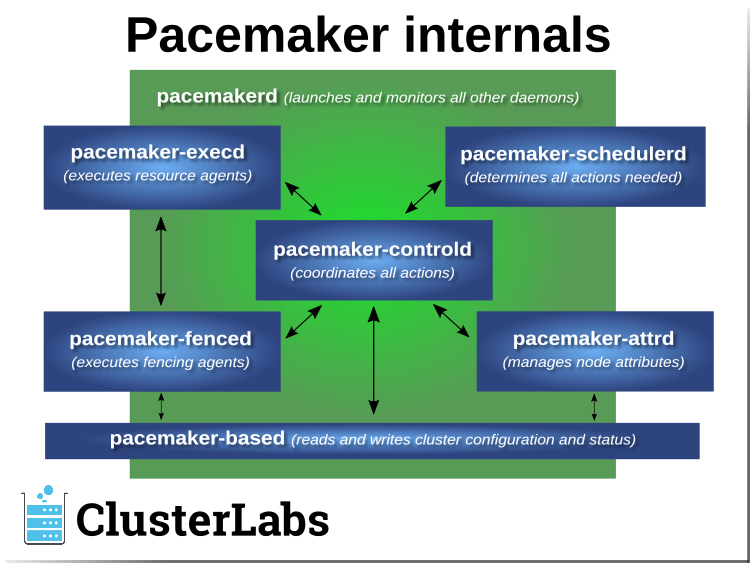
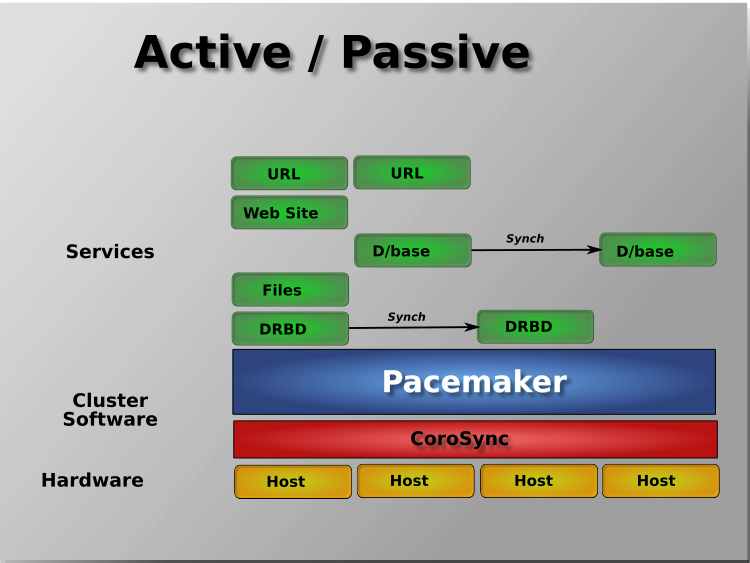
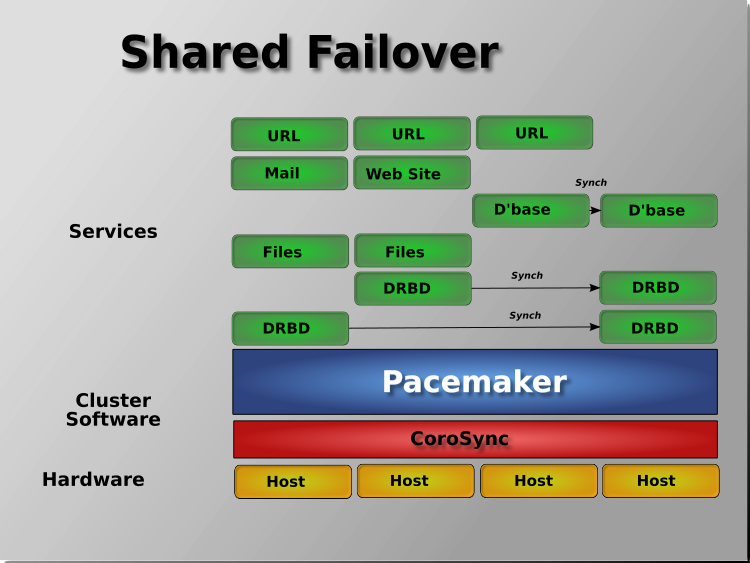
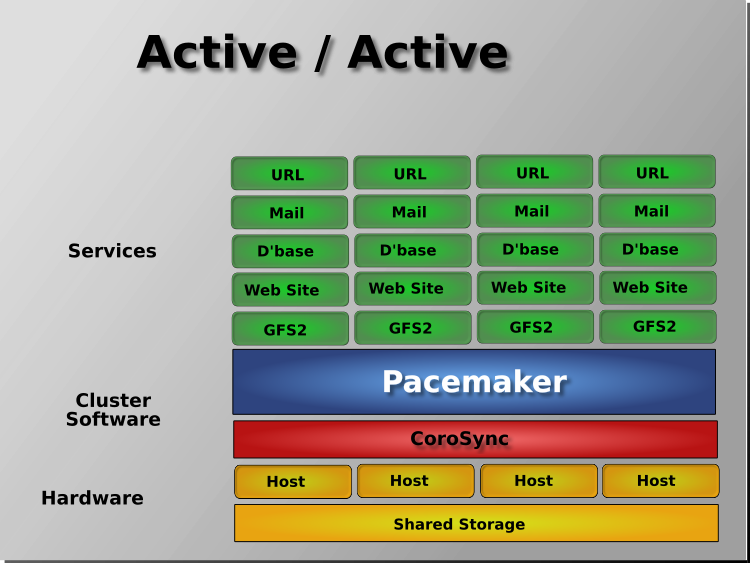

What Is Pacemaker?
####################

Pacemaker is a high-availability *cluster resource manager* -- software that
runs on a set of hosts (a *cluster* of *nodes*) in order to preserve integrity
and minimize downtime of desired services (*resources*). [#]_ It is maintained
by the `ClusterLabs <https://www.ClusterLabs.org/>`_ community.

Pacemaker's key features include:

* Detection of and recovery from node- and service-level failures
* Ability to ensure data integrity by fencing faulty nodes
* Support for one or more nodes per cluster
* Support for multiple resource interface standards (anything that can be
  scripted can be clustered)
* Support (but no requirement) for shared storage
* Support for practically any redundancy configuration (active/passive, N+1,
  etc.)
* Automatically replicated configuration that can be updated from any node
* Ability to specify cluster-wide relationships between services,
  such as ordering, colocation, and anti-colocation
* Support for advanced service types, such as *clones* (services that need to
  be active on multiple nodes), *promotable clones* (clones that can run in
  one of two roles), and containerized services
* Unified, scriptable cluster management tools

.. note:: **Fencing**

   *Fencing*, also known as *STONITH* (an acronym for Shoot The Other Node In
   The Head), is the ability to ensure that it is not possible for a node to be
   running a service. This is accomplished via *fence devices* such as
   intelligent power switches that cut power to the target, or intelligent
   network switches that cut the target's access to the local network.

   Pacemaker represents fence devices as a special class of resource.

   A cluster cannot safely recover from certain failure conditions, such as an
   unresponsive node, without fencing.

Cluster Architecture
____________________

At a high level, a cluster can be viewed as having these parts (which together
are often referred to as the *cluster stack*):

 * **Resources:** These are the reason for the cluster's being -- the services
   that need to be kept highly available.

 * **Resource agents:** These are scripts or operating system components that
   start, stop, and monitor resources, given a set of resource parameters.
   These provide a uniform interface between Pacemaker and the managed
   services.

 * **Fence agents:** These are scripts that execute node fencing actions,
   given a target and fence device parameters.

 * **Cluster membership layer:** This component provides reliable messaging,
   membership, and quorum information about the cluster. Currently, Pacemaker
   supports `Corosync <http://www.corosync.org/>`_ as this layer.

 * **Cluster resource manager:** Pacemaker provides the brain that processes
   and reacts to events that occur in the cluster. These events may include
   nodes joining or leaving the cluster; resource events caused by failures,
   maintenance, or scheduled activities; and other administrative actions.
   To achieve the desired availability, Pacemaker may start and stop resources
   and fence nodes.

 * **Cluster tools:** These provide an interface for users to interact with the
   cluster. Various command-line and graphical (GUI) interfaces are available.

Most managed services are not, themselves, cluster-aware. However, many popular
open-source cluster filesystems make use of a common *Distributed Lock
Manager* (DLM), which makes direct use of Corosync for its messaging and
membership capabilities and Pacemaker for the ability to fence nodes.

.. image:: ../shared/images/pcmk-stack.png
   :alt: Example cluster stack
   :align: center

Pacemaker Architecture
______________________

Pacemaker itself is composed of multiple daemons that work together:

* ``pacemakerd``
* ``pacemaker-attrd``
* ``pacemaker-based``
* ``pacemaker-controld``
* ``pacemaker-execd``
* ``pacemaker-fenced``
* ``pacemaker-schedulerd``

Pacemaker's main process (``pacemakerd``) spawns all the other daemons, and
respawns them if they unexpectedly exit.

The *Cluster Information Base* (CIB) is an
`XML <https://en.wikipedia.org/wiki/XML>`_ representation of the cluster's
configuration and the state of all nodes and resources. The *CIB manager*
(``pacemaker-based``) keeps the CIB synchronized across the cluster, and
handles requests to modify it.

The *attribute manager* (``pacemaker-attrd``) maintains a database of
attributes for all nodes, keeps it synchronized across the cluster, and handles
requests to modify them. These attributes are usually recorded in the CIB.

Given a snapshot of the CIB as input, the *scheduler*
(``pacemaker-schedulerd``) determines what actions are necessary to achieve the
desired state of the cluster.

The *local executor* (``pacemaker-execd``) handles requests to execute
resource agents on the local cluster node, and returns the result.

The *fencer* (``pacemaker-fenced``) handles requests to fence nodes. Given a
target node, the fencer decides which cluster node(s) should execute which
fencing device(s), and calls the necessary fencing agents (either directly, or
via requests to the fencer peers on other nodes), and returns the result.

The *controller* (``pacemaker-controld``) is Pacemaker's coordinator,
maintaining a consistent view of the cluster membership and orchestrating all
the other components.

Pacemaker centralizes cluster decision-making by electing one of the controller
instances as the *Designated Controller* (*DC*). Should the elected DC process
(or the node it is on) fail, a new one is quickly established. The DC responds
to cluster events by taking a current snapshot of the CIB, feeding it to the
scheduler, then asking the executors (either directly on the local node, or via
requests to controller peers on other nodes) and the fencer to execute any
necessary actions.

.. note:: **Old daemon names**

    The Pacemaker daemons were renamed in version 2.0. You may still find
    references to the old names, especially in documentation targeted to
    version 1.1.

    .. table::

       +-----------------------+------------------------+
       | Old name              | New name               |
       +=======================+========================+
       | ``attrd``             | ``pacemaker-attrd``    |
       +-----------------------+------------------------+
       | ``cib``               | ``pacemaker-based``    |
       +-----------------------+------------------------+
       | ``crmd``              | ``pacemaker-controld`` |
       +-----------------------+------------------------+
       | ``lrmd``              | ``pacemaker-execd``    |
       +-----------------------+------------------------+
       | ``stonithd``          | ``pacemaker-fenced``   |
       +-----------------------+------------------------+
       | ``pacemaker_remoted`` | ``pacemaker-remoted``  |
       +-----------------------+------------------------+

Node Redundancy Designs
_______________________

Pacemaker supports practically any `node redundancy configuration
<https://en.wikipedia.org/wiki/High-availability_cluster#Node_configurations>`_
including *Active/Active*, *Active/Passive*, *N+1*, *N+M*, *N-to-1*, and
*N-to-N*.

Active/passive clusters with two (or more) nodes using Pacemaker and
`DRBD <https://en.wikipedia.org/wiki/Distributed_Replicated_Block_Device>`_ are
a cost-effective high-availability solution for many situations. One of the
nodes provides the desired services, and if it fails, the other node takes
over.

Pacemaker also supports multiple nodes in a shared-failover design, reducing
hardware costs by allowing several active/passive clusters to be combined and
share a common backup node.

When shared storage is available, every node can potentially be used for
failover. Pacemaker can even run multiple copies of services to spread out the
workload. This is sometimes called N-to-N redundancy.

.. rubric:: Footnotes

.. [#] *Cluster* is sometimes used in other contexts to refer to hosts grouped
       together for other purposes, such as high-performance computing (HPC),
       but Pacemaker is not intended for those purposes.
